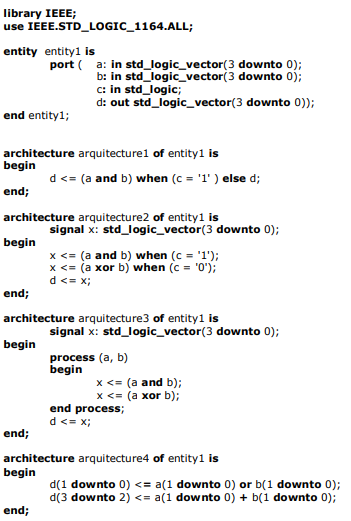
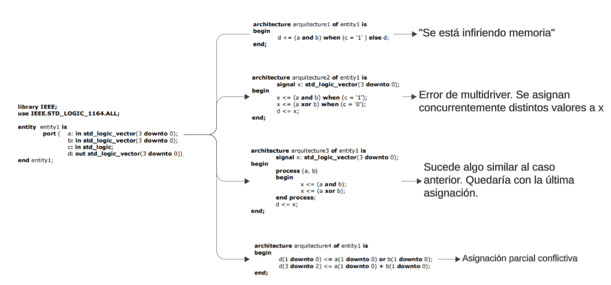

# Ejercicio: Sumador completo 8 bits

## Enunciado

Determine si existen errores para cada una de las arquitecturas de la entidad entity1

## Archivos incluidos

- **`imagen`**: La imagen incluída en el archivo es el código original del pdf en caso de que no lo tengas, no lo encuentres o no sea posible visualizarlo o dar con el por algún motivo. Son códigos erróneos que no funcionan pero hay que saber por qué. 

## Resolución

---

Autor: Christian Scornaienchi